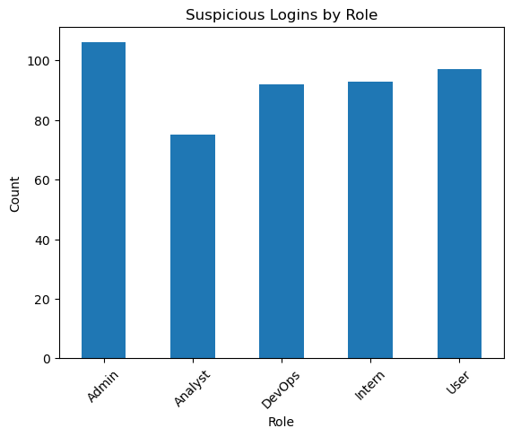
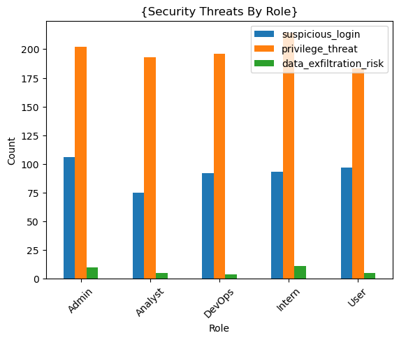
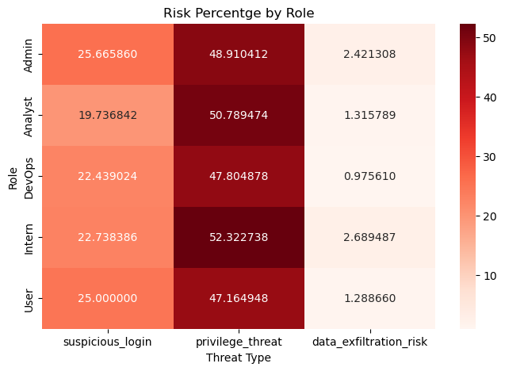

# Cloud Security Threat Detection
End-to-End cloud security threat simulation and role-based risk analysis using Python.

## Project Overview

This project simulates cloud log data to detect:
- Suspicious login attempts
- Privilege escalation threats
- Data exfiltration risks

## Technologies Used
- Python
- Pandas
- NumPy
- Matplotlib
- Seaborn

## Project Structure
Cloud_Security_Threat_Detection.ipynb 
- Data simulation
- Feature engineering
- Threat detection logic
- Visualisation
- Risk analysis

## Key Results
- Total Suspicious Logins Detected: 476
- Total Privilege Escalation Attempts: 972
- Total Data Exfiltration Risks: 24

- Highest suspicious login percentage : User role (27.29%)
- Highest privilege threat percentage: Intern role (55.23%)

## Sample Visualization

### Suspicious Logins

### Security Threats by Role

### Risk Percentage Heatmap

